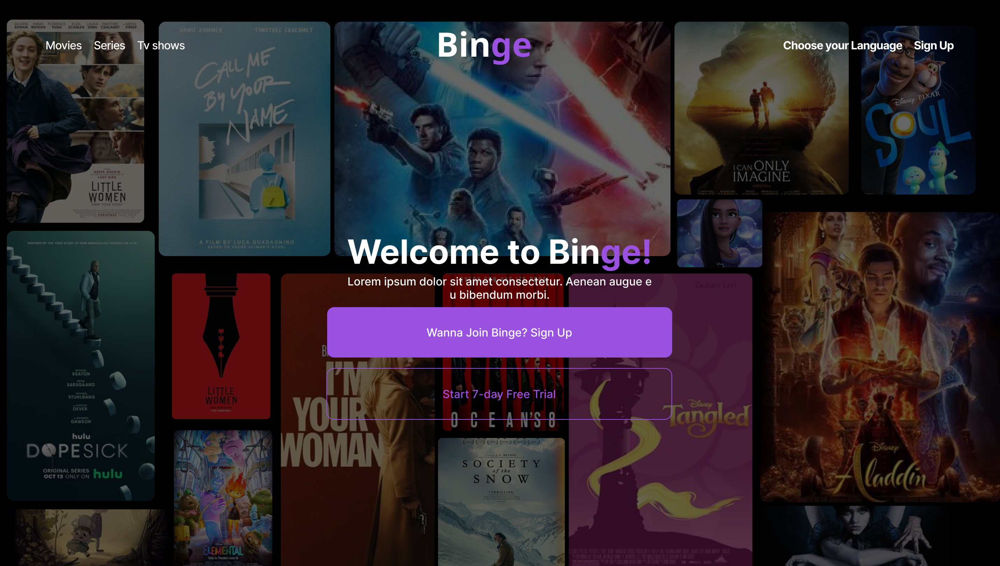

# Binge

## 🚀 Project Overview
Binge is an innovative streaming service designed to simplify entertainment by integrating a massive library of movies, TV shows, and originals into a single platform. It addresses the challenges of juggling multiple streaming services and endless scrolling by offering a streamlined browsing and watching experience. With Binge, users gain the power of entertainment curation in one convenient and user-friendly app.

## 📷 Demo

## 💭 Problem Statement
Finding the perfect entertainment can feel overwhelming. Endless scrolling, limited options, and fragmented services leave you wanting more.​​

Binge solves this challenge by seamlessly integrating everything you love about streaming. We offer a streamlined experience for browsing, watching, and managing your account – all in one place. ​

## 📈 Value Proposition
Introducing Binge ​- Entertainment, For Everyone.

We recognize the struggle of juggling multiple streaming services and the frustration of limited content.  Binge is here to change the game.​

We offer a seamless experience that puts the power of entertainment curation in your hands. Browse a massive library of movies, TV shows, and originals, all conveniently housed under one roof. No more switching between apps or missing out on must-see content.​

## 🌐 Live URL
[https://binge.decagon.dev](https://binge.decagon.dev)

## ⚙️ Technologies Used
- C#
- ASP.NET Core
- AutoMapper
- Entity Framework Core
- Identity Framework
- Microsoft SQL Server
- Serilog
- MailKit
- MimeMessage
- React
- Axios
-Docker

## 🤝🏽 Contributors
- Johnbosco Ezeani - [GitHub](https://github.com/JohnboscoEzeani)
- Oluwapelumi Olalekan - [GitHub](https://github.com/pelumi-guy)
- Elizabeth Okhomina - [GitHub](https://github.com/okhominalizzy)
- John Olayemi - [GitHub](https://github.com/Johnayo7)
- Israel Ekhor-Obakpolor - [GitHub](https://github.com/israelobk)
- Chikezie Ethelbert - [GitHub](https://github.com/Ethelbert-C)
- Ebuwa Iguobaro - [GitHub](https://github.com/JuliaEbuwa)
- Ukamaka Nnebuo - [GitHub](https://github.com/nnebuoukamaka)
- Christopher Amatu - [GitHub](https://github.com/Christox1)

## 🧑🏾‍✈️ Technical Leads
- Adedayo Adesegun (Stack Lead) - [GitHub](https://github.com/Adedayo-A)
- John Kehinde (Stack Associate) - [GitHub](https://github.com/PrinceJK)
- Shalom Gar (Stack Associate) - [GitHub](https://github.com/mistagar)
- Elizabeth Okisamen (Program Associate) - [LinkedIn](https://www.linkedin.com/in/elizabeth-okisamen/)
